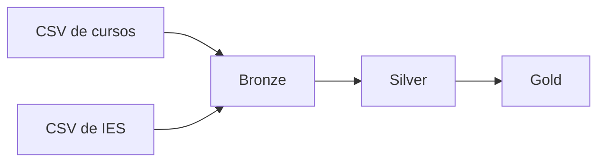

# pyspark-censo-superior

Pipeline de dados em PySpark com arquitetura Medalhão (Bronze, Silver e Gold), construído em cima dos microdados do Censo da Educação Superior 2024, do Inep.

Tudo roda localmente e grava em Parquet.



## Como está organizado

```
pipeline/
├── bronze.py   lê os CSVs do Inep e grava em Parquet, sem mexer em nada
├── silver.py   junta cursos com instituições e traduz alguns códigos
└── gold.py     gera as tabelas agregadas
```

Cada script lê o que o anterior gravou:

| Script | Entrada | Saída |
|--------|---------|-------|
| bronze.py | CSVs em `data/` | `data/bronze/cursos`, `data/bronze/ies` |
| silver.py | bronze | `data/silver/cursos` |
| gold.py | silver | `data/gold/ingressantes_uf`, `data/gold/resumo_rede` |

Na silver, o arquivo de cursos ganha o nome da instituição (join pelo `CO_IES`) e duas colunas de texto: `DS_REDE` (pública/privada) e `DS_MODALIDADE` (presencial/EaD), no lugar dos códigos numéricos.

Na gold ficaram duas tabelas: ingressantes por UF e um resumo por rede.

## Uma coisa que me pegou

Achei que cada linha do arquivo de cursos fosse um curso. Não é: cada linha é um curso **em um município**. Um curso EaD com polo em 300 cidades aparece 300 vezes.

Isso muda bastante o resultado:

| Rede | Linhas | Cursos distintos | Ingressantes |
|------|--------|------------------|--------------|
| Privada | 700.198 | 34.403 | 4.435.283 |
| Pública | 20.151 | 11.747 | 575.330 |

Se contasse linhas, a rede privada pareceria 35 vezes maior que a pública. Contando cursos, é umas 3 vezes. Por isso a gold usa `countDistinct` no código do curso.

## Para rodar

Precisa de Python 3.13 e Java 21 (usei o Temurin).

```bash
python -m venv .venv
.venv\Scripts\activate
pip install -r requirements.txt
```

Os dados não estão no repositório porque são grandes. Baixe os microdados do Censo da Educação Superior 2024 no site do Inep e coloque estes dois arquivos dentro de `data/`:

- `MICRODADOS_CADASTRO_CURSOS_2024.CSV`
- `MICRODADOS_ED_SUP_IES_2024.CSV`

Depois, da raiz do projeto:

```bash
python pipeline/bronze.py
python pipeline/silver.py
python pipeline/gold.py
```

**No Windows**, o Spark só consegue gravar arquivos com o `winutils.exe` e o `hadoop.dll` (peguei os da versão 3.3.6 em [cdarlint/winutils](https://github.com/cdarlint/winutils)). Coloque os dois numa pasta `hadoop\bin` e ajuste o caminho do `HADOOP_HOME` no começo de cada script.

## Colunas usadas

| Coluna | O que é |
|--------|---------|
| `CO_CURSO`, `NO_CURSO` | código e nome do curso |
| `CO_IES`, `NO_IES` | código e nome da instituição |
| `SG_UF` | estado |
| `TP_REDE` | 1 pública, 2 privada |
| `TP_MODALIDADE_ENSINO` | 1 presencial, 2 EaD |
| `QT_ING` | ingressantes |

O dicionário completo vem no zip do Inep. Ajuda saber o padrão dos nomes: `CO_` é código, `NO_` é nome, `TP_` é um tipo codificado, `QT_` é quantidade.

## Fonte

Microdados do Censo da Educação Superior 2024, Inep.
